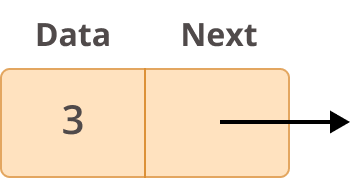

# Linked Lists

## Table of Contents

* [Introduction](#introduction)
* [Structure](#structure)
* [Linked Lists in Python](#linked-lists-in-python)
* [Linked List vs Dynamic Array](#linked-list-vs-dynamic-array)
* [Example](#example-reverse-using-deque)
* [Problem to Solve](#problem-to-solve-reverse-function)

## Introduction
A linked list is a collection of data whose elements are stored in a random way in memory which means that elements are not next to the other like Dynamic Arrays or Lists (for more information scroll or down clic here: [Linked List vs Dynamic Array](#differences-between-a-linked-list-and-a-dynamic-array)). Therefore, the structure needs a way to track the position of each element to keep the structure together, here we introduce the term of a __Node__. A linked list is a collection of nodes. The node will contain both the value and a link to the next node.



_Picture From: https://realpython.com/linked-lists-python/_
## Structure

In a link list we called the first node __the head__ and the last one __the tail__. If you know where __the head__ is, you will be able to traverse the entire list and access to all the nodes of the structure. __The tail's__ next value is always set as `None` to determine the end of the structure. 


_Picture From: https://realpython.com/linked-lists-python/_

## Linked Lists in Python
There are a couple of ways to implement a linked list in Python. We will use `collections.deque` on this example.

First, you will need to import the `deque` object from the `collections` module.

```python
from collections import deque
```
Now, you can simply initialize an empty linked list and populate it as follows:
```python
>>> lnklist = deque()
>>> lnklist
deque([])

>>> lnklist.append('qwerty')
>>> lnklist
deque(['q','w','e','r','t','y'])

>>> lnklist.pop()
'y'

>>> lnklist
deque(['q','w','e','r','t'])
```

As you can see, this kind of implementation seems to behave like a simple Dynamic Array, but under the hood, every element (Node) has a link to the next Node. The `add()` and `pop()` properties insert and remove a node respectively from the right of the linked list. However, this structure ables us to add or remove items from the left of the list without sacrificing performance which we will explain later in this guide.

```python
>>> lnklist.appendleft('a')
>>> lnklist
deque(['a','q','w','e','r','t'])

>>> lnklist.popleft()
'a'

>>> lnklist
deque(['q','w','e','r','t'])
```
These are the most common operations in a liked list  using `collections.deque()`.

|Operation| Description | Python Code | Performance |
|---------|-------------|-------------|-------------|
|add_tail(value)|Insert a value to the right end of the struture|lnklist.append(value)|O(1)|
|remove_tail()|Delete and return the right most value of the structure|lnklist.pop()|O(1)|
|add_head(value)|Insert a value to the left end of the structure|lnklist.appendleft(value)|O(1)|
|remove_head()|Delete and return the left most value of the structure | lnklist.popleft()|O(1)|
|insert(i,value)|Insert a new value next to the 'i' node|lnklist.inset(i,value)|O(n)|
|remove(i)|Remove the node 'i'|del lnklist[i]|O(n)
|size()| Return an integer which represent the length of the struture|len(lnklist)|O(1)|
|count(value)|Counts the number of ocurrences of 'value' in the structure|lnklist.count(value)|O(n)|
|reverse()|Return the structure in reverse order|lnklist.reverse()|O(n)|

## Linked List vs Dynamic Array

The main difference between a linked list and a dynamic array is the memory management; one has its elements connected by links because they are dispersed in memory and the other has its elements contiguous respectively. Therefore, the same operations might have different performances.

|Operation|Dynamic Array|Linked List|
|---------|-------------|-----------|
|Insert Front|O(n)|O(1)|
|Insert Middle|O(n)|O(n)
|Insert End|O(1)|O(1)|
|Remove Front|O(n)|O(1)|
|Remove Middle|O(n)|O(n)
|Remove End|O(1)|O(1)|

## Example: Reverse Using Deque
In this example we will see how simple it is to reverse a linked list using `collections.deque()`.

```python
>>> my_example = deque()
>>> my_example
deque([])

>>> my_example.append('2','3','5','7','11','13')
>>> my_example
deque(['2','3','5','7','11','13'])

# Use reverse() to reverse the order of our linked list
>>> my_example.reverse()
deque(['13','11','7','5','3','2'])
```

## Problem to Solve: Reverse Function
Now you will have the oportunity to implement a Linked List using classes and functions in Python. You will be provided a template. Take time to carefully read the comments and undertand the program before start.

Your challenge is to implement the `reverse()` function in such a way that your program could return the content of a Linked List but in a reverse order.

Start here: [Linked List Template](linked_list_template.py)

> This template has been take and adapted from "07-prove_linked_list.py" CSE212 (c) BYU-Idaho - It is a violation of BYU-Idaho Honor Code to post or share this code with others or 
to post it online.  Storage into a personal and private repository (e.g. private
GitHub repository, unshared Google Drive folder) is acceptable.

You can check your code with the solution here: [Reverse Function Solution](linked_list_template_solution.py)
> The solution provided for the problem has been written by the author of this guide.

[Back to Welcome Page](0_Welcome.md)