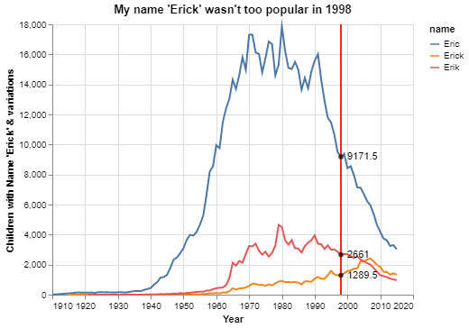
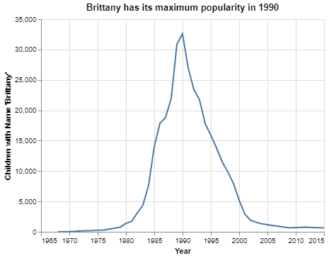
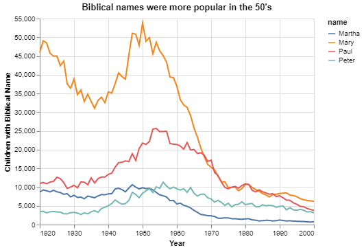
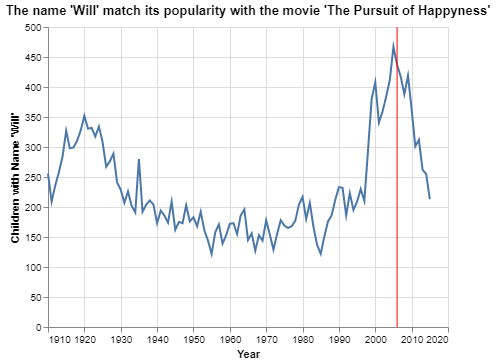

# Project 1: What's in a name?

__Erick Vega__

## Project Summary

This project will analyze the use of specific names throughout history, from relatives' names to actors' names. The data has been taken from a cleaned data set of birth names by year with counts for US states. The analysis will include customized charts which are essential to visualize the total of children named with a particular name over a  range of time. The main purpose of this project is to understand how and when external influences can affect how parents name their children, from Christianity to movie releases.

## Technical Details

#### 1. How does your name at your birth year compare to its use historically?

In this section, we will see how popular was my name "Erick" in my birth year, 1998. In addition, to make this analyzes more interesting, we will see other variations of the mentioned name such as "Eric" and "Erik" around the same year.



 
|Name | 1998   |
|---|---------|
|Eric | 9,171 children|
|Erik | 2,661 children|
|Erick | 1,289 children|
|__Total__|__13,121__|
In the chart above we can see that children named with my name "Erick" are represented with a solid orange line. It is evident that the variation of my name wasn't as popular as the variation "Eric" was. If we consider the total of children in 1998 with this variation of names, my name "Erick" only represents 9.8%. We can conclude that my name wasn't too popular in 1998 in the United States compared with other variations of the same name and that my parents didn't choose my name guided by that time trend.


#### 2. If you talked to someone named Brittany on the phone, what is your guess of his or her age? What ages would you not guess?

I would guess that she is between 25 to 30 years old. Let's see if the data confirm or refute our guess.



The chart above shows us that the name "Brittany" was more popular around the '90s. So if we subtract our current year (2021) and (1990) we get 31. We can conclude that most people named "Brittany" can have around 31 years old which is almost what we guess at the beginning of this section.

#### 3. Mary, Martha, Peter, and Paul are all Christian names. From 1920 to 2000, compare the name usage of each of the four names.



|Name | max children | peak year| average|
|---|---------|---------|---------|
|Mary | 53,791| 1950| 27,321 |
|Paul| 25,662| 1954 | 13,346 |
|Peter| 11,321| 1956 | 5,763 |
|Martha| 10,651| 1947 | 5,151|

On the chart above we can see that around the '50s there was a boom of Christian or Biblical Names in the United States. This matches the fact that after World War II, more people embraced religious affiliations and churches expanded fastly around the country (https://news.usc.edu/25835/The-1950s-Powerful-Years-for-Religion/). Nevertheless, we can see an evident decay of Christianity and religious people around 2000.

#### 4. Think of a unique name from a famous movie. Plot the usage of that name and see how changes line up with the movie release.

In this section, we will analyze if factors like an actor's name of a famous movie may have an influence on children's names born in the year of the movie release. 

For our analysis, we will take the name of the famous actor "Will Smith" and one of his iconic movies "The Pursuit of Happyness" and see if that movie motivated parents to name their children "Will" in the year 2006 when this movie was released.



We can observe that around the year 2006 the name has its maximum values. Nevertheless, from that same year and forward the name decays in popularity. But there are other important things to take under consideration in this case. First, Will Smith had another famous movie equivalent in popularity in 1997, "Men in Black". That could contribute to an important increment of children named Will between 1997 and 2006 which is the time marked between the vertical red lines. Second, Will Smith is not the complete name of the actor, his real name is Willard Caroll Smith, Jr. The name Will is often used as a nickname for names like Willard or William. That can explain why even at its peak, the name Will reaches less than 500 children with that name.

## Appendix A

```python
import pandas as pd
import altair as alt

# Convert the csv file into a DataFrame with pandas
names_data = pd.read_csv("names_year.csv")

## How does your name at your birth year compare to its use historically?

# Separe especific names from the principal dataset
ericks = names_data.query("name == ['Erick','Eric','Erik'] ")

# Create a char displaying years and totals using the queried dataset above
base_chart = (alt.Chart(ericks)
        .encode(
            x= alt.X('year', axis = alt.Axis(format = 'd', title = "Year")), 
            y = alt.Y('Total', axis = alt.Axis(title = "Children with Name 'Erick' & variations")),
            color = "name"
        )
        .mark_line()
)

# Find people who was born only in 1998
query_birth_year = ericks.query("year == 1998")

# Create a vertical line in the year given above
birth_year_line = (alt.Chart(query_birth_year)
                .mark_rule(color = "red")
                .encode( x = "year")
                )
# Find the intersections of 'base chart' and 'birth_year_line' by drawing points
birth_year_intersections = (alt.Chart(query_birth_year)
                        .encode(
                            x = "year",
                            y = "Total",
                        )
                        .mark_circle(color = "black")

# Label each interseccion with the Total of people with that name in the given year                      
)
birth_year_intersections_text = (alt.Chart(query_birth_year)
    .encode(
        x = "year",
        y = "Total",
        text = "Total"
    )
    .mark_text(
        align='left',
        baseline='middle',
        dx=7
        )
)

final_chart = base_chart + birth_year_line + birth_year_intersections + birth_year_intersections_text
final_chart.properties(title = "My name 'Erick' wasn't too popular in 1998",)

## If you talked to someone named Brittany on the phone, what is your guess of his or her age? What ages would you not guess?

# She is probably 25 years old
# Separe especific names from the principal dataset
brittanies = names_data.query("name == 'Brittany'")

# Create a char displaying years and totals using the queried dataset above
brittanies_base_chart = (alt.Chart(brittanies)
.encode( 
    x= alt.X('year', axis = alt.Axis(format = 'd', title = "Year")), 
    y = alt.Y('Total', axis = alt.Axis(title = "Children with Name 'Brittany'")))
.mark_line()
)

brittanies_base_chart.properties(title = "Brittany has its maximum popularity in 1990")

## Mary, Martha, Peter, and Paul are all Christian names. From 1920 to 2000, compare the name usage of each of the four names.

# Create a list with the names to separate from the main dataset
bible_names = ['Mary', 'Martha', 'Peter', 'Paul']

# Use @ to call variables inside a query
bible_names_data = names_data.query("name in @bible_names & 1920 <= year <= 2000")

base_chart = (alt.Chart(bible_names_data)
.encode(
    x= alt.X('year', axis = alt.Axis(format = 'd', title = "Year")), 
    y = alt.Y('Total', axis = alt.Axis(title = "Children with Biblical Name")),
    color = "name")
.mark_line()
)

base_chart.properties(title = "Biblical names were more popular in the 50's")
# Using our list of names we want to determine when and how many children each name
# had on their peaks and how many on average
for iname in bible_names:
    max_use = bible_names_data.query("name == @iname").Total.max()
    max_year = bible_names_data.query("Total == @max_use").year.max()

    mean_use = bible_names_data.query("name == @iname").Total.mean()


    print(f"{iname}: {max_use} max people in {max_year}")    
    print(f"{iname}: {mean_use:.2f} avg people between 1920 and 2000 ")
    print()
    
## Think of a unique name from a famous movie. Plot the usage of that name and see how changes line up with the movie release.

#We will plot the usage of the name "Will" because of Will Smith and compare with his iconic movie "The Pursuit of Happyness" which was released in 2006.

movie_actor_data = names_data.query("name == 'Will'")

base_chart = (alt.Chart(movie_actor_data)
.encode(x= alt.X('year', axis = alt.Axis(format = 'd', title = "Year")), 
    y = alt.Y('Total', axis = alt.Axis(title = "Children with Name 'Will'")))
.mark_line()
)

# The movie "Pursuit of happyness was released in 2006"
release_movie_2006 = movie_actor_data.query("year == 2006")

# The movie "Men in Black" was released in 1997
release_movie_1997 = movie_actor_data.query("year == 1997")

# Create vertical lines to represent the year of movies' release
release_movie_line1 = (alt.Chart(release_movie_2006)
                .mark_rule(color = "red")
                .encode( x = "year")
                )

release_movie_line2 = (alt.Chart(release_movie_1997)
                .mark_rule(color = "red")
                .encode( x = "year")
                )

final_chart2 = base_chart + release_movie_line1 + release_movie_line2
final_chart2.properties(title = "The name 'Will' match its popularity with the movie 'The Pursuit of Happyness' ")
```
