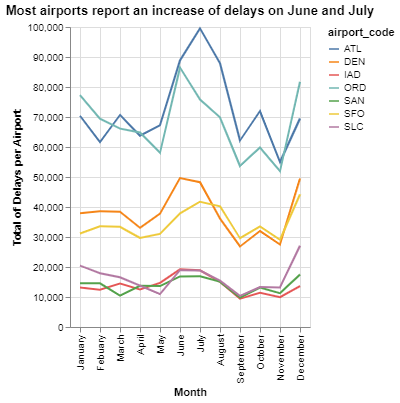
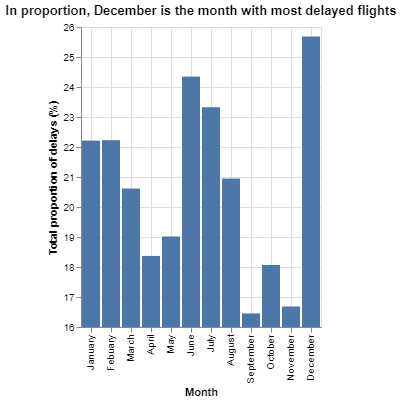
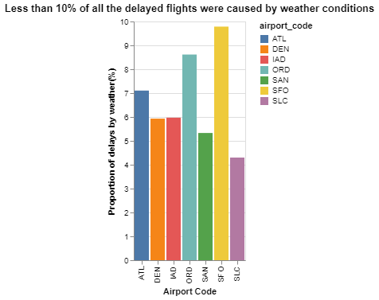

# Project 2: Are we missing JSON on our flight?

__Erick Vega__

## Project Summary

This project will various cases of delayed flights on 7 U.S airports had over a period of 10 years (between 2005 and 2010). Among the most relevant data we will found the number of delayed flights per month, the number of delayed flights per airport, how many minutes of delay, and the main causes for those delays. This analysis could be used to help people preventing them from traveling on specific months or help airports and airlines anticipate potential risks on their future flights, saving them resources like money and time.


## Technical Details

#### 1. Which airport has the worst delays?

First, we will define the word 'worst'. In this case, talking about flights, the worst scenario for either a passenger or an airport is to lose a flight or having a delay. This implies that there will be people arriving late for their final destinations which causes stress and uncertainty. Delays can cost thousands of dollars for airports and airlines. 

Now, that we have an idea of the worst-case scenario. We can say that every airport is concerned about how many flights had been delayed in comparison with all their flights and how much time they have lasted. This data may help airports take better decisions and prepare for unexpected events.

In the following table, we will see how many flights each airport had between 2005 and 20015, how many of them were delayed, the proportion of delayed flights, and an average of how many hours the delays lasted. Based on that, we will determine which airport had the worst delays.

| airport_code   |   total_flights |   total_delays |   total_delay_mins |   prop_delays |   avg_delay_hours |
|:---------------|----------------:|---------------:|-------------------:|--------------:|------------------:|
| SFO            |      1630945.00 |      425604.00 |        26550493.00 |          0.26 |              1.04 |
| ORD            |      3597588.00 |      830825.00 |        56356129.00 |          0.23 |              1.13 |
| ATL            |      4430047.00 |      902443.00 |        53983926.00 |          0.20 |              1.00 |
| IAD            |       851571.00 |      168467.00 |        10283478.00 |          0.20 |              1.02 |
| SAN            |       917862.00 |      175132.00 |         8276248.00 |          0.19 |              0.79 |
| DEN            |      2513974.00 |      468519.00 |        25173381.00 |          0.19 |              0.90 |
| SLC            |      1403384.00 |      205160.00 |        10123371.00 |          0.15 |              0.82 |

Notice that the table is sorted by the proportion of delays and then by the average delay time in hours. 

Looking at the table above and considering our definition of 'worst' we can conclude that San Francisco Airport has the worst delays because 26% of its flights were delayed in some measure and the average delay time in hours was of 1.04 hours.

#### 2. What is the best month to fly if you want to avoid delays of any length? 

First, we will see a chart representing how many cumulative delayed flights each airport had on each month over a period of 10 years



Notice that there is a pattern in the wave that airports have delays. Most of them report an increase in delays in June and July.

Now, we will consider the proportion of delayed flights of all the airports by month. This will annul any advantage or disadvantage an airport may have because of their total number of flights. Remember that when we talk about the proportion of delayed flights we are referring to the relationship between all the flights (delayed or not) and all the delayed flights. This proportion is important because it ables us to see the real meaning of the data. We can think that according to the chart above Atlanta Airport has the worst delays because it has more delays than the other airports, nevertheless, Atlanta airport has more flights than the others, so even with that number of flights only 20% were delayed in comparison with San Francisco Airport that has fewer flights but 26% were delayed.



Interesting! The worst month to travel is December because, in relation to the number of flights, each airport has a high percentage of delays. June and July are next on the list of worst months to travel. A possible theory about this result is that because of the Summer break between June and July, most people travel either for vacation or to visit family and the same applies to December for Christmas and New Year celebrations; this increases the number of flights, therefore, the probabilities of delays too.

#### 3. Create a new column that calculates the total number of flights delayed by weather (both severe and mild). 

The following table is an extract of the first 5 rows and 5 last columns of a DataFrame that calculates an approximate of how many delayed flights were caused by weather conditions either severe or mild. 

|    | airport_code   |   severe_weather |   mild_weather_late_aircraft |   mild_weather_nas |   num_delays_weather |
|---:|:---------------|-----------------:|-----------------------------:|-------------------:|---------------------:|
|  0 | ATL            |              448 |                      332.731 |            2988.7  |              3769.43 |
|  1 | DEN            |              233 |                      278.4   |             607.75 |              1119.15 |
|  2 | IAD            |               61 |                      317.4   |             581.75 |               960.15 |
|  3 | ORD            |              306 |                      676.5   |            3519.75 |              4502.25 |
|  4 | SAN            |               56 |                      204     |             414.7  |               674.7  |

We can learn that there are around 6 times more delays caused by weather than what the original dataset informs because we are considering the mild weather conditions too, instead of only the severe ones.

The rules used for our calculations are the following: 

- 1. 100% of delayed flights in the Weather category are due to weather.
- 2. 30% of delayed flights in the Late-Arriving category are due to weather.
- 3. From April to August, 40% of delayed flights in the NAS category are due to weather. The rest of the months, the proportion rises to 65%.

#### 4. Create a barplot showing the proportion of all flights that are delayed by weather at each airport.

In the following chart, we will show the proportion of all the flights that were delayed by weather at each airport.



As we can see, San Francisco Airport almost reaches 10% of its delayed flights caused by different weather conditions. All the other airports have less tendency to have delays because of weather.

#### 5. Fix all of the varied missing data types in the data to be consistent.

Here we can see an example of how some invalid values have been successfully replaced with "NaN" or "null" in this json format.

```
{
        "airport_code": "IAD",
        "airport_name": null,
        "month": "January",
        "year": 2005.0,
        "num_of_flights_total": 12381,
        "num_of_delays_carrier": "414",
        "num_of_delays_late_aircraft": 1058.0,
        "num_of_delays_nas": 895,
        "num_of_delays_security": 4,
        "num_of_delays_weather": 61,
        "num_of_delays_total": 2430,
        "minutes_delayed_carrier": null,
        "minutes_delayed_late_aircraft": 70919,
        "minutes_delayed_nas": 35660.0,
        "minutes_delayed_security": 208,
        "minutes_delayed_weather": 4497,
        "minutes_delayed_total": 134881
    }
```

## Appendix A

```python
# Project 2: Are we missing JSON on our flight?
import pandas as pd   # to load and transform data
import numpy as np    # for math/stat calculations
import altair as alt

# from file to pandas dataframe
flights = pd.read_json("flights_missing.json")

## 1. Which airport has the worst delays?

prop_total_delays = (flights.groupby('airport_code')
    .agg(total_flights = ('num_of_flights_total', sum),
        total_delays = ('num_of_delays_total', sum),
        total_delay_mins = ('minutes_delayed_total', sum))
    .assign(prop_delays = lambda x: x.total_delays / x.total_flights,
            avg_delay_hours = lambda x: x.total_delay_mins / x.total_delays / 60)
    .sort_values(by = ["prop_delays", "avg_delay_hours"], ascending = False)
)

print(prop_total_delays.to_markdown(floatfmt='.2f'))
## 2. What is the best month to fly if you want to avoid delays of any length? 
# Create a new DataFrame without those rows that contains "n/a" under the column 'month'
clear_months = (flights.drop(flights.index[flights["month"] == "n/a"]))

# Create a DataFrame where the rows are grouped by airport_code and month
delays_airport_month = (clear_months.groupby(by=["airport_code", "month"])
        .agg(total_delays_per_month = ("num_of_delays_total",sum))
        .reset_index()
        )

# Create a chart representing how many delays have had each airport for each month
base_chart = (alt.Chart(delays_airport_month)
             .encode(
                x = alt.X("month",
                        title = "Month",
                        sort=["January", "Febuary", "March", "April", "May", "June",
                                    "July", "August", "September", "October", "November", "December"]),
                y = alt.Y("total_delays_per_month",
                        title = "Total of Delays per Airport"),

                color = "airport_code"
            )
            .mark_line()
            .configure_axis(
                    grid=True)
        .properties(title = "Most airports report an increase of delays on June and July"))

base_chart
delays_month_proportion = (clear_months.groupby('month')
    .agg(total_flights = ('num_of_flights_total', sum),
        total_delays = ('num_of_delays_total', sum))
    .assign(prop_delays = lambda x: x.total_delays / x.total_flights *100)
    .reset_index()
)

base_chart2 = (alt.Chart(delays_month_proportion)
                .encode(
                    x = alt.X("month",
                            title = "Month",
                            sort=["January", "Febuary", "March", "April", "May", "June",
                                    "July", "August", "September", "October", "November", "December"]),
                    y = alt.Y("prop_delays",
                            title="Total proportion of delays (%)",
                            scale=alt.Scale(zero=False)))                   
                .mark_bar()
                .configure_axis(
                    grid=True)
                .properties(title = """In proportion, December is the month with most delayed flights"""))

base_chart2

## 3. Create a new column that calculates the total number of flights delayed by weather (both severe and mild). 
# Calculate the average of the column um_of_Delays_late_aircraft
late_aircraft_avg = flights.num_of_delays_late_aircraft.replace(-999,np.nan).mean()

# Copy the orifinal DataFrame
q3 = flights

# Replace all the invalid values -999 with a standard missing value only in the column "num_of_delays_late_aircraft"
q3.num_of_delays_late_aircraft.replace(-999, late_aircraft_avg, inplace = True)

# Calculate how many flights were delayed because of severe and mild weather conditions
weather = q3.assign(
    severe_weather = q3.num_of_delays_weather,
    mild_weather_late_aircraft = .3*q3.num_of_delays_late_aircraft,
    mild_weather_nas = np.where(q3.month.isin(["April","May","June","July","August"]), 
                                    .4*q3.num_of_delays_nas, 
                                    .65*q3.num_of_delays_nas),
    num_delays_weather =  lambda x: x.severe_weather + x.mild_weather_late_aircraft + x.mild_weather_nas

)

print(weather[["airport_code","severe_weather","mild_weather_late_aircraft","mild_weather_nas","num_delays_weather"]].head().to_markdown())
## 4. Create a barplot showing the proportion of all flights that are delayed by weather at each airport.
# Create a DataFrame that contains the proportion of delays caused by weather conditions grouped by airport
delays_by_weather_by_airport = (weather.groupby('airport_code')
    .agg(total_flights = ('num_of_flights_total', sum),
        total_delays_weather = ('num_delays_weather', sum))
    .assign(prop_delays_weather = lambda x: x.total_delays_weather / x.total_flights *100 )
    .reset_index()
    
)


delays_by_weather_by_airport
base_chart3 = (alt.Chart(delays_by_weather_by_airport)
                    .encode(
                        x = alt.X("airport_code",
                        title="Airport Code"),
                        y = alt.Y("prop_delays_weather",
                        title="Proportion of delays by weather(%)"),
                        color = "airport_code"
                    )
                    .mark_bar()
                    .properties(title="Less than 10% of all the delayed flights were caused by weather conditions")
)

base_chart3
## 5. Fix all of the varied missing data types in the data to be consistent
import json

# Replace all the missing values with NaN
consistent_flights = flights.replace([-999,"1500+","","n/a"], np.nan)
consistent_flights.info()
# Create a DataFrame with only those rows that contain NaN values
nan_flights= consistent_flights[consistent_flights.isna().any(axis=1)]

# Using the DataFrame created above, create a json document
json_flights = nan_flights.to_json(orient="records")
json_object = json.loads(json_flights)
json_formatted_str = json.dumps(json_object, indent = 4)
print(json_formatted_str)

```
