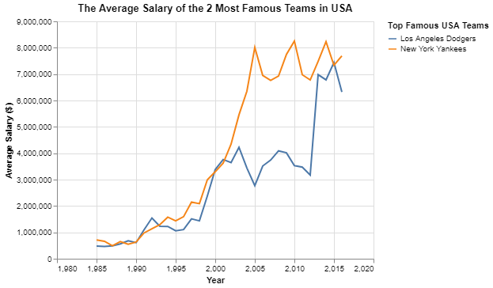

# Project 3: Finding relationships in baseball

__Erick Vega__


## Project Summary

In this project, we will define connections between different entities in baseball. These connections will take the form of tables and charts to ease the interpretation of their meaning. We will focus on the relationships between baseball players, their teams, salaries, and achievements along with their careers.
## Technical Details

#### 1. Write an SQL query to create a new dataframe about baseball players who attended BYU-Idaho. The new table should contain five columns: playerID, schoolID, salary, and the yearID/teamID associated with each salary. 

In the following table we will see that our dataset contains two baseball players that attended to BYU-Idaho; the first one, 'lindsma01' called Matthew Raymond earned up to \$4 million dollars in 2014 playing for Chicago White Sox while the second one, "stephga01" called Garret Charies earned his higher salary of about \$1 million dollars in 2001 playing for St.Louis Browns.

|    | playerID   | schoolID   |   Year | Team  |   Salary |
|---:|:-----------|:-----------|---------:|:---------|---------:|
|  0 | lindsma01  | idbyuid    |     2014 | CHA      | $4,000,000 |
|  1 | lindsma01  | idbyuid    |     2012 | BAL      |  $3,600,000 |
|  2 | lindsma01  | idbyuid    |     2011 | COL      |  $2,800,000 |
|  3 | lindsma01  | idbyuid    |     2013 | CHA      |  $2,300,000 |
|  4 | lindsma01  | idbyuid    |     2010 | HOU      |  $1,625,000 |
|  5 | stephga01  | idbyuid    |     2001 | SLN      |  $1,025,000 |
|  6 | stephga01  | idbyuid    |     2002 | SLN      |   $900,000 |
|  7 | stephga01  | idbyuid    |     2003 | SLN      |   $800,000 |
|  8 | stephga01  | idbyuid    |     2000 | SLN      |   $550,000 |
|  9 | lindsma01  | idbyuid    |     2009 | FLO      |   $410,000 |
| 10 | lindsma01  | idbyuid    |     2008 | FLO      |   $395,000 |
| 11 | lindsma01  | idbyuid    |     2007 | FLO      |   $380,000 |
| 12 | stephga01  | idbyuid    |     1999 | SLN      |   $215,000 |
| 13 | stephga01  | idbyuid    |     1998 | PHI      |   $185,000 |
| 14 | stephga01  | idbyuid    |     1997 | PHI      |   $150,000 |


#### 2.This three-part question requires you to calculate batting average (number of hits divided by the number of at-bats)

* a. Write an SQL query that provides playerID, yearID, and batting average for players with at least 1 at bat that year. Sort the table from highest batting average to lowest, and then by playerid alphabetically. Show the top 5 results in your report.

We used the following query:
```python
dw.query('byuidss/cse-250-baseball-database', 
                """SELECT playerid AS playerID, yearid AS Year, h/ab as Batt_avg
                    FROM batting
                    WHERE ab >= 1
                    ORDER BY Batt_avg DESC, playerID
                    LIMIT 5""")
```

|    | playerID   |   Year |   Batt_avg |
|---:|:-----------|-------:|-----------:|
|  0 | aberal01   |   1957 |          1 |
|  1 | abernte02  |   1960 |          1 |
|  2 | abramge01  |   1923 |          1 |
|  3 | acklefr01  |   1964 |          1 |
|  4 | alanirj01  |   2019 |          1 |

You are probably wondering what does the number 1 means on the column "Batt_avg" in the table above. Well, that means that these guys hit all their at-bats. Impressive! Isn't it? But, the reality is that they only had 1 at-bat in their careers and fortunately they hit that one, being that a perfect score of 1/1.

* b. Use the same query as above, but only include players with at least 10 at bats that year. Print the top 5 results.

We used the following query:
```python
dw.query('byuidss/cse-250-baseball-database', 
                """SELECT playerid AS playerID, yearid AS Year, h/ab as Batt_avg
                    FROM batting
                    WHERE ab >= 10
                    ORDER BY batt_avg DESC
                    LIMIT 5""")
```

|    | playerID   |   Year |   Batt_avg |
|---:|:-----------|-------:|-----------:|
|  0 | nymanny01  |   1974 |   0.642857 |
|  1 | carsoma01  |   2013 |   0.636364 |
|  2 | altizda01  |   1910 |   0.6      |
|  3 | johnsde01  |   1975 |   0.6      |
|  4 | silvech01  |   1948 |   0.571429 |

In the table above we observe that the best hitter with more than 10 at-bats was the player "nymanny01" called Nyls Wallace Rex hit 60% of all his at-bats in 1974.

* c. Now calculate the batting average for players over their entire careers (all years combined). Only include players with at least 100 at bats, and print the top 5 results.

We used the following query:

```python
dw.query('byuidss/cse-250-baseball-database', 
                """SELECT playerid AS playerID, SUM(h)/SUM(ab) AS Batt_Career_Avg
                    FROM batting
                    GROUP BY playerid   
                    HAVING SUM(ab)>= 100  
                    ORDER BY Batt_Career_Avg DESC           
                    LIMIT 5""")
```

|    | playerID   |   Batt_Career_Avg |
|---:|:-----------|------------------:|
|  0 | cobbty01   |          0.366299 |
|  1 | barnero01  |          0.359682 |
|  2 | hornsro01  |          0.358497 |
|  3 | jacksjo01  |          0.355752 |
|  4 | meyerle01  |          0.355509 |

In the table above we observe that the best hitter throughout his entire career was the player "cobbty01" called Tyrus Cobb. During Cobb's career, he had 11436 at-bats and 4189 hits.

#### 3. Pick any two baseball teams and compare them using a metric of your choice (average salary, home runs, number of wins, etc). Write an SQL query to get the data you need, then make a graph in Altair to visualize the comparison.

For the next analysis, we will use some data from the two most famous baseball teams according to [bolavip.com](https://bolavip.com/en/mlb/atlanta-braves-vs-houston-astros-how-to-watch-2021-world-series-game-4-predictions-and-odds-20211029-0020.html) in the United States: Los Angeles Dodgers and the New York Yankees. We will visualize the salaries of each of the teams' players on average between the years 1985 to 2016.



In the chart above we appreciate that even when in the year 2015 both teams reach an average salary of about \$7.5 million dollars, the New York Yankees had a higher average salary for more years than the Los Angeles Dodgers. Los Angeles reached its highest average salary in 2015 with \$7.4 million dollars, while New York Yankees reached its highest average salary in 2010 with \$8.2 million dollars.

## Appendix A

```python
# Project 3: Finding relationships in baseball
import datadotworld as dw
import altair as alt
## 1. Write an SQL query to create a new dataframe about baseball players who attended BYU-Idaho.

byu_baseball = dw.query('byuidss/cse-250-baseball-database', 
                """SELECT DISTINCT playerid as playerID , schoolid AS schoolID, s.yearid AS Year, s.teamid AS Team, salary AS Salary
                    FROM collegeplaying cp
                    JOIN salaries s
                    USING(playerid)
                    WHERE schoolid = 'idbyuid'
                    ORDER BY salary DESC""")
print(byu_baseball.dataframe.to_markdown())
## 2. This three-part question requires you to calculate batting average (number of hits divided by the number of at-bats)
### a. Write an SQL query that provides playerID, yearID, and batting average for players with at least 1 at bat that year. Sort the table from highest batting average to lowest, and then by playerid alphabetically. Show the top 5 results in your report.
bat_avg_1 = dw.query('byuidss/cse-250-baseball-database', 
                """SELECT playerid AS playerID, yearid AS Year, h/ab as Batt_avg
                    FROM batting
                    WHERE ab >= 1
                    ORDER BY Batt_avg DESC, playerID
                    LIMIT 5""")
print(bat_avg_1.dataframe.to_markdown())


### b. Use the same query as above, but only include players with at least 10 at bats that year. Print the top 5 results.
bat_avg_2 = dw.query('byuidss/cse-250-baseball-database', 
                """SELECT playerid AS playerID, yearid AS Year, h/ab as Batt_avg
                    FROM batting
                    WHERE ab >= 10
                    ORDER BY batt_avg DESC
                    LIMIT 5""")
print(bat_avg_2.dataframe.to_markdown())

### c. Now calculate the batting average for players over their entire careers (all years combined). Only include players with at least 100 at bats, and print the top 5 results.
bat_avg_3 = dw.query('byuidss/cse-250-baseball-database', 
                """SELECT playerid AS playerID, SUM(h)/SUM(ab) AS Batt_Career_Avg, SUM(h), SUM(ab)
                    FROM batting
                    GROUP BY playerid   
                    HAVING SUM(ab)>= 100  
                    ORDER BY Batt_Career_Avg DESC           
                    LIMIT 5""")

print(bat_avg_3.dataframe.to_markdown())
Examples to solve question  3
teams_lan_nya = dw.query('byuidss/cse-250-baseball-database', 
                """ SELECT s.yearid, teamid, AVG(salary), name
                    FROM salaries s
                    JOIN teams t
                    USING (teamid)
                    WHERE teamid = 'LAN' OR teamid = 'NYA'
                    GROUP BY s.yearid,teamid
                    ORDER BY AVG(salary) desc""")
print(teams_lan_nya.dataframe.to_markdown())

main_salary_chart = (alt.Chart(teams_lan_nya.dataframe)
                    .encode(alt.X("yearid:Q", axis=alt.Axis(title= "Year")),alt.Y("avg", axis=alt.Axis(title="Average Salary ($)",)),color=alt.Color("name",title="Top Famous USA Teams"))
                    .mark_line()
                    .properties(title = "The Average Salary of the 2 Most Famous Teams in USA"))

main_salary_chart
```
