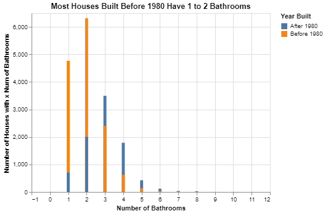
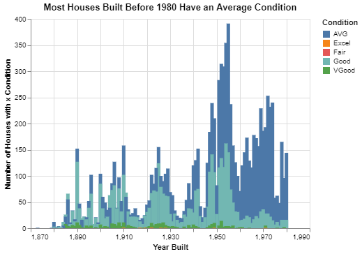
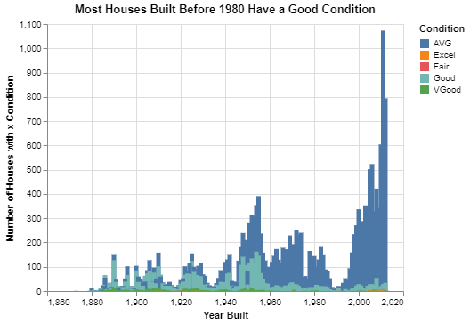
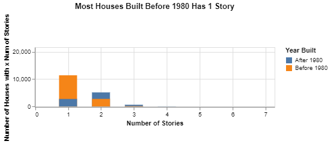
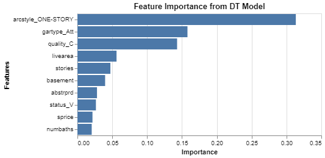

# Project 4: Classifying Homes

__Erick Vega__

## Project Summary

The following project is intended to create a Machine Learning (ML) model able to identify whether if a home was built before the 1980s or after. Our model will use around 30 different features to learn what is a "Before 1980" house. Our model will be measured in terms of it precision and accuracy to ensure its reliability. ML models help to predict new unknown information, save industry millions of dollars, and make "smarter" tools to enhance human life.

## Technical Details

#### 1. Create 2-3 charts that evaluate potential relationships between the house variables and the variable before1980 Explain what you learn from the charts that could help a machine learning algorithm.

##### Chart 1: Number of Bathrooms in Houses Built Before 1980

In the following chart, we evaluate the relationship between the number of bathrooms in a house and the year that the house was built. The variable "Number of Bathrooms" was considered relevant in this relationship since, according to [Derek Thopmson](https://www.theatlantic.com/ideas/archive/2020/01/why-do-american-houses-have-so-many-bathrooms/605338/) in the Magazine *The Atlantic*, "In the past half-century, the number of bathrooms per person in America has doubled. We went from two people per bathroom to one person per bathroom in the last 50 years." Therefore, we may infer that the number of bathrooms in the house built before the 1980s have fewer bathrooms than the newer houses. The next chart confirms our theory. 



As shown in the chart above, most houses built before 1980 have between 1 and 2 bathrooms while houses built after 1980 are more likely to have 3 bathrooms. This little difference can be a good feature for a machine learning model that tries to find the year that a house was built.

##### Chart 2: The Physical Condition of Homes Built Before 1980

Another important variable that may be relevant to our machine learning model is the general condition of a house. Time and normal use tend to wear down the home, so we can think that the condition of houses built before 1980 should be worse than the newer ones. Let's use some charts to verify this theory.




Our table above shows us that most houses built before 1980 are in an AVG or "Average" condition. Here are more details about the table above:

|    | Condition   |   Total Houses by Condition |
|---:|:------------|----------------------------:|
|  0 | AVG         |                        9938 |
|  1 | Good        |                        4207 |
|  2 | VGood       |                         325 |
|  3 | Excel       |                           8 |
|  4 | Fair        |                           1 |

Nevertheless, we may be incorrect if we ignore the rest of our data, or in other words, we should verify the information about houses built after 1980 to have a broader and preciser interpretation. So, we will design a chart using all the houses built in any year and compare their conditions.



685 / 5000
Resultados de traducción
Note that the condition of most houses built after 1980 is AVG or "Average" as well as houses built before 1980. Therefore our machine learning model can get a bit confusing if we ask it to look for the year an AVG house was built; it won't be able to tell if it was before or after 1980. To fix that problem, another category of condition may be helpful if it has a stronger relationship to the year a house was built. Taking a broader perspective from the chart above, we can suggest that most of the houses built before 1980 are in "Good condition". 


##### Chart 3: Number of Stories in Houses Built Before 1980

The last variable that we will consider is the number of stories that houses may have. With better technology and more resistant materials, there are more houses built with more than one level, so we can see if there is a consistent relationship between the number of stories of a house and the year that was built. 



As shown above, most houses (more than 70%) built before 1980 are single-story buildings. This could be an excelent feature for our model.

#### 2. Build a classification model labeling houses as being built “before 1980” or “during or after 1980”. Your goal is to reach 90% accuracy. Explain your final model choice (algorithm, tuning parameters, etc) and describe what other models you tried.

I decided to use a Decision Tree Classifier since it is one of the most efficient and accurate ML algorithms known, at least in Python. This algorithm basically takes all the features of a dataset and using an algorithm called Attribute Selection Measure, selects the best attribute of a given instance and makes that attribute a decision node. Each decision node helps the Classifier to be "smarter" and separate instances into the best category possible.

For this model, I only changed a couple of parameters. I set ```max_depth``` with a value of 12 and ```random_state``` with a value of 1.

I tried other classification models like ```GaussianNB()``` and ```RandomForestClassifier()```, but they were not as convenient as the ```DecisionTreeClassifier()``` model. Actually, the ```RandomForestClassifier()``` model obtained a surprising accuracy of 92% but sacrificed important computer resources like memory and time of processing. That should not be a problem when good processing resources are available. On the other hand, the ```GaussianNB()``` model, even when faster than ```RandomForestClassifier()```, was not as accurate as the other models mentioned here. 

The following table shows a summary of my tests of the models.

|Model Name|Processing Time (aprox)|Accuracy|
|----------|---------------|--------|
|GaussianNB|0.7 sec     | 67%    |
|DecisionTreeClassifier|0.1s  | 90%|
|RandomForestClassifier| 2.7s | 92%

#### 3. Justify your classification model by discussing the most important features selected by your model. This discussion should include a chart and a description of the features.

The ```DecisionTreeClassifier()``` model has an attribute called ```feature_importances_``` that able us to see how important the model thinks each variable or feature is. 

Using the mentioned attribute, here are the top 10 most important features for to our model.



Knowing what features are relevant helps us to know what features we should use to train our ML model and which ones get rid of. I removed 11 features from my model that scored 0.00 of importance and it improved the model's accuracy by 6%. This is due to we are reducing the changes of "overfeeding" our model with irrelevant information that makes our model get confused. The columns that were removed were: ```arcstyle_CONVERSIONS, gartype_det/CP, gartype_att/CP, arcstyle_SPLIT LEVEL, gartype_CP, totunits, arcstyle_TWO AND HALF-STORY,  condition_Fair, condition_Excel, quality_X```.

As we observe in the chart above, the most relevant feature of our model, with more than 30%, is the number of stories represented by the variable "arcstyle_ONE-STORY". What this feature means is that most houses built before 1980 had only one level and usually a basement (as shown in the variable "basement"). This is probably because the physical space available to build in the country was larger than today; before than spacious roads, airports, big companies, and large building complexes. Surprisingly, another interesting feature is "numbaths" which we previously analyzed and conclude that there is a pattern that correlates the number of bathrooms and houses built before and after 1980, but we did not realize the important impact that it would have on our model. 

In conclusion, most of the important characteristics of our model have a lot to do with the architectural structure and style of the houses, but they do not have a strong relationship with the condition and quality of the building.

#### 4. Describe the quality of your classification model using 2-3 different evaluation metrics. You also need to explain how to interpret each of the evaluation metrics you use.

#### Precision

Remember the purpose of this project, we want to identify whether a house was built before 1980 or not. To describe the quality of our classification model, we will evaluate the precision of our model by dividing the number of houses that were correctly identified as "Before1980" (True Positives) and the number of non-before1980 houses wrongly identify as "Before1980" plus those that were correctly identified.

*Precision = TP / (TP + FP)*

Before1980 Houses Correctly Identified (TP): 4443
Non-before1980 Houses Wrongly Identified(FP): 274


4443/(4443+274) = __0.94__

As shown by our simple equation above, our model correctly predicts houses built before the 1980s with a precision of 94%, an impressive metric for our purposes. Nevertheless identify 6% of houses not built before 1980 as built before 1980, these results are called "False Positives."

#### Recall

On the other hand, we will evaluate how accurate is our model based on how many houses did not identify as built before 1980. Those houses were ignored by the model thinking that they didn't have enough features of a "Before1980" house. Those results are called "False Negatives." The equation to measure this metric is the following:

*Recall = TP / (TP + FN)*

Before1980 Houses Correctly Identified (TP): 4443
Before1980 Houses Not Identified (FN): 464

4443 / (4443 + 274) = __0.90__

Recall is "the ability of your model to find all the relevant cases in your model" [ranrir.xyz](https://ranvir.xyz/blog/how-to-evaluate-your-machine-learning-model-like-a-pro-metrics/), so in our case, our model was able to find 90% of all the houses built before 1980, but ignore 10% of them.


## Appendix A


```python

# Project 4: Classifying Homes
import pandas as pd
import altair as alt
import numpy as np

from sklearn.model_selection import train_test_split
from sklearn.naive_bayes import GaussianNB
from sklearn import metrics

from sklearn.tree import DecisionTreeClassifier
from sklearn import tree
from sklearn.ensemble import RandomForestClassifier
from sklearn.ensemble import GradientBoostingClassifier

from sklearn.metrics import classification_report
from sklearn.metrics import confusion_matrix

dwellings_ml = pd.read_csv("dwellings_ml.csv")
dwellings_denver = pd.read_csv("dwellings_denver.csv")
## Question 1
#Create 2-3 charts that evaluate potential relationships between the house variables and the variable before1980 Explain what you learn from the charts that could help a machine learning algorithm.
### Chart 1: Number of Bathrooms in Houses Built Before 1980
numbaths1980_df = dwellings_ml.value_counts(['before1980','numbaths']).reset_index().rename(columns={0:'count'})
numbaths1980_df["time_description"] = np.where(numbaths1980_df['before1980']==1, "Before 1980", "After 1980")
numbaths1980_df
chart = (alt.Chart(numbaths1980_df)
        .encode(x= alt.X("numbaths", title = "Number of Bathrooms", ),
                y = alt.Y("count", title = "Number of Houses with x Num of Bathrooms", ),
                color= alt.Color("time_description:N",title="Year Built"))
        .mark_bar()
        .properties(title = "Most Houses Built Before 1980 Have 1 to 2 Bathrooms"))

chart
### Chart 2: Condition of All the Houses in the Dataset
condition_before1980 = dwellings_denver.value_counts(['yrbuilt','condition']).reset_index().rename(columns={0:'count'})
condition_before1980 = condition_before1980[condition_before1980["yrbuilt"]<= 1980] 
condition_before1980
num_condition_before1980 = (condition_before1980.groupby("condition")
    .agg(total_houses_by_condition = ("count", sum))
    .sort_values('total_houses_by_condition', ascending = False)
    .reset_index())
print(num_condition_before1980.to_markdown())
chart2 = (alt.Chart(condition_before1980)
        .encode(x= alt.X("yrbuilt:Q", title = "Year Built" ),
                y = alt.Y("count:Q", title = "Number of Houses with x Condition" ),
                color= alt.Color("condition:N",title="Condition"))
        .mark_bar()
        .properties(title="Most Houses Built Before 1980 Have an Average Condition"))

chart2
condition_overall = dwellings_denver.value_counts(['yrbuilt','condition']).reset_index().rename(columns={0:'count'})
condition_overalla
chart4 = (alt.Chart(condition_overall)
        .encode(x= alt.X("yrbuilt:Q", title = "Year Built" ),
                y = alt.Y("count:Q", title = "Number of Houses with x Condition" ),
                color= alt.Color("condition:N",title="Condition"))
        .mark_bar()
        .properties(title="Most Houses Built Before 1980 Have a Good Condition"))


chart4 

### Chart 3: Number of Stories in Houses Built Before 1980
stories_before1980 = dwellings_ml.value_counts(['before1980','stories']).reset_index().rename(columns={0:'count'})
stories_before1980["time_description"] = np.where(stories_before1980['before1980']==1, "Before 1980", "After 1980")
stories_before1980
chart3 = (alt.Chart(stories_before1980)
        .encode(x= alt.X("stories:Q", title = "Number of Stories", ),
                y = alt.Y("count:Q", title = "Number of Houses with x Num of Stories", ),
                color= alt.Color("time_description:N",title="Year Built"))
        .mark_bar(size=30)
        .interactive()
        .properties(title = "Most Houses Built Before 1980 Has 1 Story", height=100))

chart3
## Question 2

#Build a classification model labeling houses as being built “before 1980” or “during or after 1980”. Your goal is to reach 90% accuracy. Explain your final model choice (algorithm, tuning parameters, etc) and describe what other models you tried.
# "X" or "independent"
features = dwellings_ml.drop(columns = ['before1980', 'yrbuilt','parcel','gartype_det/CP',"gartype_CP","arcstyle_SPLIT LEVEL","gartype_att/CP","condition_Fair", "condition_Excel", "quality_X"])

# "y" or "dependent" or "outcome"
targets = dwellings_ml.before1980

# split the data
x_train, x_test, y_train, y_test = train_test_split(features, targets, test_size = .34, random_state = 76)
### GaussianNB
# create the model
classifier = GaussianNB()

# train the model
classifier.fit(x_train, y_train)

# make predictions
y_predicted = classifier.predict(x_test)

# evaluate model (see how good the model is)
metrics.accuracy_score(y_test, y_predicted)
### RandomForestClassifier
# create the model
classifier = RandomForestClassifier()

# train the model
classifier.fit(x_train, y_train)

# make predictions
y_predicted = classifier.predict(x_test)

# evaluate model (see how good the model is)
metrics.accuracy_score(y_test, y_predicted)
### "Decision Tree" Classifier
# create a classification model
classifier_DT = DecisionTreeClassifier(max_depth=12, random_state=1)

# train the model
classifier_DT.fit(x_train, y_train)

# use your model to make predictions!
y_predicted = classifier_DT.predict(x_test)

# test how accurate those predictions are
metrics.accuracy_score(y_test, y_predicted)

## Question 3

#Justify your classification model by discussing the most important features selected by your model. This discussion should include a chart and a description of the features.
#Look at the "feature importance". Aka, how important the model thinks the variables are.
feature_df = pd.DataFrame({'features':features.columns, 'importance':classifier_DT.feature_importances_})
feature_df.sort_values('importance', ascending = False)
(alt.Chart(feature_df.sort_values('importance', ascending = False).head(10))
    .mark_bar()
    .encode(
        x= 'importance:Q',
        y= alt.Y('features:N', sort='-x'),
        
        )
    .properties( title="Feature Importance from DT Model")
    )
## Question 4

#Describe the quality of your classification model using 2-3 different evaluation metrics. You also need to explain how to interpret each of the evaluation metrics you use.
### Confusion Matrix
metrics.plot_confusion_matrix(classifier_DT, x_test, y_test)
print(confusion_matrix(y_test, y_predicted))
### General Report of the Model
print(classification_report(y_test, y_predicted))

```
