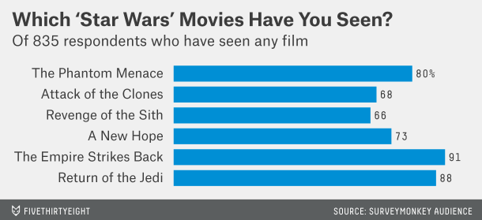
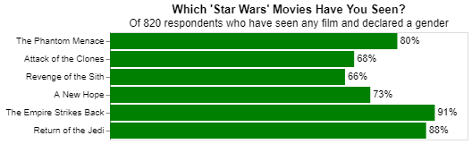
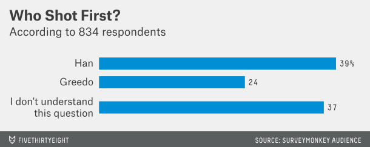
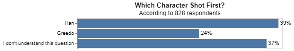

# Project 5: The war with Star Wars

__Erick Vega__


## Project Summary

Throughout this project, we will take a disorganized dataset and create a machine learning model from it. The data set we will use comes from a survey of thousands of people on "Star Wars" preferences. We will try to find out if there is a relationship between people's preferences and their income. However, we will focus on different methods of cleaning and organizing a messy dataset.
## Technical Details

#### 1. Shorten the column names and clean them up for easier use with pandas.

The original dataset is far from being used to train an effective machine learning model because it has confusing column names - it can be understood by humans but also by computers. However, in this step, we will find that with a couple of tweaks, our data frame will be ready to use.

Our first task will be to define unique column names for each variable. If we look carefully at the original data set, we can see that there is a relationship between the first two rows; the first row appears to represent survey questions, while the second row primarily represents the responses to the questions in the first row. Our ultimate goal is to match the question and answer nicknames and create a single string for each column.

There are 9 long questions in the first row, so we will give them a shorter nickname as follows:

|Original Question|Nickname|
|-----------------|--------|
|Have you seen any of the 6 films in the Star Wars franchise?                      |seen_any |
|Which of the following Star Wars films have you seen? Please select all that apply| seen |
|Do you consider yourself to be a fan of the Star Wars film franchise?             |is_fan_sw|
|Please rank the Star Wars films in order of preference with 1 being your favorite film in the franchise and 6 being your least favorite film| mrank |
|Please state whether you view the following characters favorably, unfavorably, or are unfamiliar with him/her            |crank_|     
|Which character shot first?| shot_first|       
|Are you familiar with the Expanded Universe? |expanded_universe|   
|Do you consider yourself to be a fan of the Expanded Universe?|fan_expanded_universe|  
|Do you consider yourself to be a fan of the Star Trek franchise? |fan_star_trek| 

Also, we will make some small adjustments to the answers in the second row to make sure they are formatted correctly. In this step, we will simplify the names of the Star Wars movies. For example, we will convert "Star Wars: Episode I The Phantom Menace" to "i_the_phanton_menace" and so on.

Finally, we will combine the first and second "new" rows and insert them into the original data set.

If we run ```sw_data.columns```, we will get the following new column names:

```
Index(['respondentid', 'seen_any', 'is_fan_sw', 'seen_i__the_phantom_menace',
       'seen_ii__attack_of_the_clones', 'seen_iii__revenge_of_the_sith',
       'seen_iv__a_new_hope', 'seen_v_the_empire_strikes_back',
       'seen_vi_return_of_the_jedi', 'mrank_i__the_phantom_menace',
       'mrank_ii__attack_of_the_clones', 'mrank_iii__revenge_of_the_sith',
       'mrank_iv__a_new_hope', 'mrank_v_the_empire_strikes_back',
       'mrank_vi_return_of_the_jedi', 'crank_han_solo', 'crank_luke_skywalker',
       'crank_princess_leia_organa', 'crank_anakin_skywalker',
       'crank_obi_wan_kenobi', 'crank_emperor_palpatine', 'crank_darth_vader',
       'crank_lando_calrissian', 'crank_boba_fett', 'crank_c-3p0',
       'crank_r2_d2', 'crank_jar_jar_binks', 'crank_padme_amidala',
       'crank_yoda', 'shot_first', 'expanded_universe',
       'fan_expanded_universe', 'fan_star_trek', 'gender', 'age',
       'household_income', 'education', 'location_census_region'],
      dtype='object')
```


#### 2. Please validate that the data provided on GitHub lines up with the article by recreating 2 of their visuals and calculating 2 summaries that they report in the article.

##### Graph 1

*Article Graph*


*Our Graph*


This graph is similar to the one provided in the article, but instead of 835 respondents, there are 820 respondents that have seen at least one 'Star Wars' film and explicitly declared a gender. 

##### Graph 2

*Article Graph*


*Our Graph*


This other graph is similar to the one provided in the article, but instead of 834 respondents, there are 828 respondents who answer the question "Who Shot First?"

##### Summary 1

85% of men have seen at least one "Star Wars" film

| Seen Any? (Male)|Percentage|
|:----|-----------:|
| Yes |   85.11% |
| No  |   14.89% |

##### Summary 2

72% of women have seen at least one "Star Wars" film

| Seen Any? (Female)| |
|:----|-----------:|
| Yes |   72.31% |
| No  |   27.68% |

#### 3. Clean and format the data so that it can be used in a machine learning model. As you format the data, you should complete each item listed below. In your final report provide example(s) of the reformatted data with a short description of the changes made.

##### a. Filter the dataset to respondents that have seen at least one film.

After filtering our dataset we find that from the 1186 respondents, 936 have seen at least one 'Star Wars' film. 

##### b. Create a new column that converts the age ranges to a single number. Drop the age range categorical column.
##### c. Create a new column that converts the school groupings to a single number. Drop the school categorical column.
##### d. Create a new column that converts the income ranges to a single number. Drop the income range categorical column.

I converted 'age', 'education', and 'income' categories to numeric columns. The following table represents the last 5 rows of our 3 new categories.


|   age_min |   education |   income_min |
|----------:|------------:|-------------:|
|        45 |          14 |            0 |
|        18 |          14 |            0 |
|        30 |          16 |        50000 |
|        45 |          14 |       100000 |
|        60 |          20 |        50000 |


##### e. One-hot encode all remaining categorical columns.

I order to make it easier for the computer to read the dataset we will need to make sure that each value in the set is a number. Therefore, we will use a Pandas property called ```get_dummies()``` to convert a categorical variable into a new column in our dataset.

We will one-hot encode the following columns:
```
['is_fan_sw', 'seen_i__the_phantom_menace',
       'seen_ii__attack_of_the_clones', 'seen_iii__revenge_of_the_sith',
       'seen_iv__a_new_hope', 'seen_v_the_empire_strikes_back',
       'seen_vi_return_of_the_jedi', 'crank_han_solo', 'crank_luke_skywalker',
       'crank_princess_leia_organa', 'crank_anakin_skywalker',
       'crank_obi_wan_kenobi', 'crank_emperor_palpatine', 'crank_darth_vader',
       'crank_lando_calrissian', 'crank_boba_fett', 'crank_c-3p0',
       'crank_r2_d2', 'crank_jar_jar_binks', 'crank_padme_amidala',
       'crank_yoda', 'shot_first', 'expanded_universe',
       'fan_expanded_universe', 'fan_star_trek', 'gender', 'location_census_region']
```

The following table represents the first 5 columns and the first 5 rows of the original dataser after being one-hot encoded.

|is_fan_sw_Yes |   crank_han_solo_somewhat_favorably |   crank_han_solo_somewhat_unfavorably |   crank_han_solo_unfamiliar |   crank_han_solo_very_favorably |
|-------------:|------------------------------------:|--------------------------------------:|----------------------------:|--------------------------------:|
|            1 |                                   0 |                                     0 |                           0 |                               1 |
|            1 |                                   0 |                                     0 |                           0 |                               1 |
|            1 |                                   0 |                                     0 |                           0 |                               1 |
|            1 |                                   0 |                                     0 |                           0 |                               1 |
|            0 |                                   0 |                                     0 |                           0 |                               1 |
#### f. Create your target (also known as "y" or "label") column based on the new income range column.

Since our Machine Learning model is intended to predict whether a person makes more than \$50k, our target column will be the one that contains the income of the respondents, specifically, we will focus on those rows where the income is greater than $50k.

This is our target column:
```
y = (starwars_ml.income_min >= 50000)*1
```

#### 4. Build a machine learning model that predicts whether a person makes more than $50k. Describe your model and report the accuracy.

After organizing and cleaning up our data, we are ready to create a Machine Learning model. First, we split our data using the ```train_test_split()``` method from ```sklearn.model_selection```. From our 'starwars_ml' dataset, 30% is used as the testing part, and we set a fixed random state as well. Second, we use a Decision Tree Classifier algorithm with the following parameters ```DecisionTreeClassifier(max_depth = 7, random_state=1)```. I chose this algorithm because predicting data has a logarithmic cost, the complexity of the decisions can be controlled, and it performs well even when some assumptions are violated by the 'true' model of the algorithm [(Scikit-learn.org)](https://scikit-learn.org/stable/modules/tree.html#tree).


##### Top 10 Most Important Features

Let's take a look of those features that are considered the most relevant to the target "income > $50k". 
| Features                               |   Importance |
|:---------------------------------------|-------------:|
| education                              |    0.0848805 |
| mrank_vi_return_of_the_jedi            |    0.0816397 |
| age_min                                |    0.0766213 |
| mrank_ii__attack_of_the_clones         |    0.0585088 |
| crank_jar_jar_binks_Unfamiliar (N/A)   |    0.0502947 |
| crank_r2_d2_Somewhat favorably         |    0.0478215 |
| mrank_iv__a_new_hope                   |    0.0445382 |
| crank_padme_amidala_Very favorably     |    0.0435831 |
| location_census_region_South Atlantic  |    0.0350944 |
| crank_padme_amidala_Somewhat favorably |    0.0332416 |

Notice that no feature has a relevance greater than 8%. This is not surprising since there is not a strong relationship between a person's income and his/her Star Wars preferences. Nevertheless, features like 'education', 'age', and 'location' (that may have a correlation with someone's income) are present in our top 10, which help us know that our model is reliable in some measure. The other features may or may not have a real relationship -- who knows? --, but more data is needed to confirm this.

##### Metrics of the Star Wars - Income ML Model

Finally, after running and testing our model we get the following metrics which help us see how accurate our model is.
|Metric|Score|Description|
|------|-----|-----------|
|Recall|0.77| It is the ability of your model to find all the relevant cases in your model.|
|Precision|0.69| Ability of a model to identify only the relevant data points.|
| Accuracy|0.63| Number of correct answer over the total number of test cases|

Considering that our dataset is too short to create a strong and reliable model, having 63% of accuracy is a good start.

## Appendix A

```python
# Project 5
import pandas as pd
import altair as alt
import numpy as np

# "ISO-8859-1" will fix the problem with reading special characters of our data
sw_cols = pd.read_csv("StarWars.csv", encoding= "ISO-8859-1", header=None, nrows =2) # Select only the first 2 rows of our data with no header
sw_data = pd.read_csv("StarWars.csv", encoding= "ISO-8859-1", header=None, skiprows=2) # Skip the first 2 rows with no header

# Question 1
We will need to fix and clean up our data first:
1. We need specific names for our columns 
>>> Reading recommended for this week: Python for Data Science: Strings

# We need a Series to manipulate the columns names
# We can use .iloc() to pull the first row as a column
# To fill the NaN fills between question que can use forward fill .ffill()
# Replace spaces with .replace(" ", "_") or 
# Replace spaces with .replace("Have you seen any of the 6 films in the Star Wars franchise?", "seen_") 
question_cols = (sw_cols.iloc[0,:]
                    .ffill()
                    .replace("Which of the following Star Wars films have you seen? Please select all that apply.", "seen")  # 0 is the first row
                    .replace("Have you seen any of the 6 films in the Star Wars franchise?","seen_any")
                    .replace("Do you consider yourself to be a fan of the Star Wars film franchise?", "is_fan_sw")
                    .replace("Please rank the Star Wars films in order of preference with 1 being your favorite film in the franchise and 6 being your least favorite film.", "mrank")
                    .replace("Please state whether you view the following characters favorably, unfavorably, or are unfamiliar with him/her.", "crank_")
                    .replace("Which character shot first?", "shot_first")
                    .replace("Are you familiar with the Expanded Universe?", "expanded_universe")
                    .replace("Do you consider yourself to be a fan of the Expanded Universe?\x8cæ", "fan_expanded_universe")
                    .replace("Do you consider yourself to be a fan of the Star Trek franchise?", "fan_star_trek")
                    .str.replace(" ","_")
                    .str.replace("\(|\)","")
                    .str.lower())

options_cols = (sw_cols.iloc[1,:]
                    .replace("Response","")
                    .str.replace("Star Wars: Episode", "")
                    .str.lower()
                    .str.replace(" ","_")
                    .fillna("")
                    )


join_cols_names = question_cols + options_cols

sw_data.columns = join_cols_names

sw_data.columns
# Question 2

# Find the percentage of how many women and men have seen a film of stars wars
sw_data.value_counts(["gender","seen_any"], sort = False)
print((sw_data.query("gender == 'Male'")
        .seen_any
        .value_counts(normalize=True)
        ).to_markdown())
print((sw_data.query("gender == 'Female'")
        .seen_any
        .value_counts(normalize=True)        
        ).to_markdown())
sw_data.filter(regex="^seen__").dropna(how="all").shape
print(sw_data["shot_first"].dropna().shape)

shot = sw_data["shot_first"].dropna().value_counts(normalize=True).reset_index()
shot['percent'] = shot["shot_first"]
shot
base_chart1 = (alt.Chart(shot)
    .mark_bar()
    .encode(
        x = alt.X("shot_first", axis = None),
        y = alt.Y("index", sort=['Han',"Greedo","I don't understand this question"], title=None)
    )
    .properties(
        title = {
                "text" : ["Which Character Shot First?"],
                "subtitle" : ["According to 828 respondents"]}
    ))

chart_text1 = (alt.Chart(shot)
    .mark_text(
        align = 'left',
        dx = 3
    )
    .encode(
        x = alt.X("shot_first"),
        y = alt.Y("index", sort=['Han',"Greedo","I don't understand this question"]),
        text = alt.Text('percent' ,format='.0%')     
    
    ))

base_chart1 + chart_text1
seen_dummies = pd.get_dummies(sw_data.dropna(how="all", subset=['gender']).query("seen_any == 'Yes'").filter(['seen_i__the_phantom_menace',
       'seen_ii__attack_of_the_clones', 'seen_iii__revenge_of_the_sith',
       'seen_iv__a_new_hope', 'seen_v_the_empire_strikes_back',
       'seen_vi_return_of_the_jedi']))

seen_dummies.columns = ['The Phantom Menace',
       'Attack of the Clones', 'Revenge of the Sith',
       'A New Hope', 'The Empire Strikes Back',
       'Return of the Jedi']

seen_dummies = seen_dummies.sum().reset_index().rename(columns={0:"counts"}).assign(percent = lambda x: x.counts / 820)

sw_data.query("seen_any == 'Yes'").shape
base_chart2 = (alt.Chart(seen_dummies)
                .encode(x = alt.X("percent", axis = None),
                        y = alt.Y("index", title=None, sort=['The Phantom Menace',
       'Attack of the Clones', 'Revenge of the Sith',
       'A New Hope', 'The Empire Strikes Back',
       'Return of the Jedi'])
                        )
                .properties(
                    title = {
                        "text" : ["Which 'Star Wars' Movies Have You Seen?"],
                        "subtitle": ["Of 820 respondents who have seen any film and declared a gender"]
                    }
                )
                .mark_bar(color='green')
)

chart_text2 = (alt.Chart(seen_dummies)
    .mark_text(
        align = 'left',
        dx = 3
    )
    .encode(
        x = alt.X("percent"),
        y = alt.Y("index", sort=['The Phantom Menace',
       'Attack of the Clones', 'Revenge of the Sith',
       'A New Hope', 'The Empire Strikes Back',
       'Return of the Jedi']),
        text = alt.Text('percent' ,format='.0%')     
    
    ))

base_chart2 + chart_text2
pd.get_dummies(sw_data["shot_first"])
pd.get_dummies(sw_data["is_fan_sw"], drop_first = True)
# Question 3
# Part A
q3 = sw_data.query('seen_any == "Yes"')
q3
# Part B
ml_age = (q3.age
    .str.replace("> ", "")
    .str.split("-", expand=True)
    .rename(columns= {0:"age_min",1:"age_max"})
    .age_min
    .astype("float")
    )

ml_age.tail()
# Part C
ml_school = (q3.education.
        str.replace('Less than high school degree', '9').
        str.replace('High school degree', '12').
        str.replace('Some college or Associate degree', '14').
        str.replace('Bachelor degree', '16').
        str.replace('Graduate degree', '20').
        astype('float'))
# Part D
ml_income =(q3.household_income
                .str.replace("\$|,|\+","")
                .str.split(" - ", expand = True)
                .rename(columns= {0:"income_min",1:"income_max"})
                .income_min
                .astype("float"))

ml_income
categories_numeric = pd.concat([ml_age, ml_school, ml_income], axis=1)

print(categories_numeric.tail().to_markdown())
# Part E
ml_dummies = pd.get_dummies(q3.filter(['is_fan_sw', 'seen_i__the_phantom_menace',
       'seen_ii__attack_of_the_clones', 'seen_iii__revenge_of_the_sith',
       'seen_iv__a_new_hope', 'seen_v_the_empire_strikes_back',
       'seen_vi_return_of_the_jedi', 'crank_han_solo', 'crank_luke_skywalker',
       'crank_princess_leia_organa', 'crank_anakin_skywalker',
       'crank_obi_wan_kenobi', 'crank_emperor_palpatine', 'crank_darth_vader',
       'crank_lando_calrissian', 'crank_boba_fett', 'crank_c-3p0',
       'crank_r2_d2', 'crank_jar_jar_binks', 'crank_padme_amidala',
       'crank_yoda', 'shot_first', 'expanded_universe',
       'fan_expanded_universe', 'fan_star_trek', 'gender', 'location_census_region']), drop_first=True)

print(ml_dummies.iloc[: , :5].tail().to_markdown())
starwars_ml = pd.concat([ml_dummies, 
                         q3.filter(['mrank_i__the_phantom_menace', 'mrank_ii__attack_of_the_clones',
       'mrank_iii__revenge_of_the_sith', 'mrank_iv__a_new_hope',
       'mrank_v_the_empire_strikes_back', 'mrank_vi_return_of_the_jedi']),
                         ml_age, 
                         ml_school, 
                         ml_income], axis=1)


starwars_ml.head()

starwars_ml = starwars_ml.dropna()

#
features = starwars_ml.drop(['income_min'], axis=1) # aka, "features"
targets = (starwars_ml.income_min >= 50000)*1 # aka, "target"

from sklearn.model_selection import train_test_split
from sklearn.naive_bayes import GaussianNB
from sklearn import metrics

from sklearn.tree import DecisionTreeClassifier
from sklearn import tree
from sklearn.ensemble import RandomForestClassifier
from sklearn.ensemble import GradientBoostingClassifier

from sklearn.metrics import classification_report
from sklearn.metrics import confusion_matrix
x_train, x_test, y_train, y_test = train_test_split(features, targets, test_size = .34, random_state = 1)
# create a classification model
classifier_DT = DecisionTreeClassifier(max_depth = 7, random_state=1)

# train the model
classifier_DT.fit(x_train, y_train)

# use your model to make predictions!
y_predicted = classifier_DT.predict(x_test)

# test how accurate those predictions are
metrics.accuracy_score(y_test, y_predicted)
print(classification_report(y_test, y_predicted))
feature_df = pd.DataFrame({'features':features.columns, 'importance':classifier_DT.feature_importances_})
print(feature_df.sort_values('importance', ascending = False).head(10).to_markdown())

char = (alt.Chart(feature_df.sort_values('importance', ascending = False).head(10))
    .mark_bar()
    .encode(
        x= 'importance:Q',
        y= alt.Y('features:N', sort='-x'),
        
        )
    .properties( title="Feature Importance from DT Model")
)

char

```
