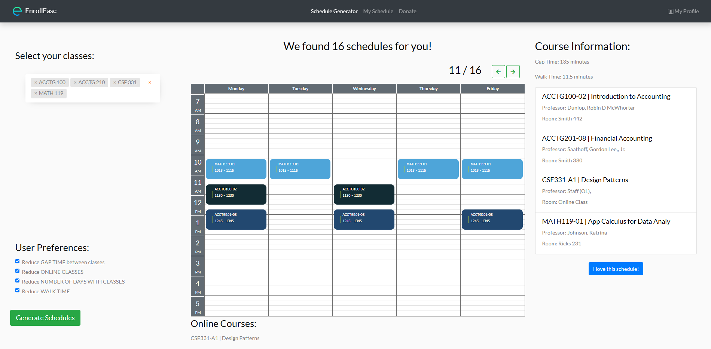
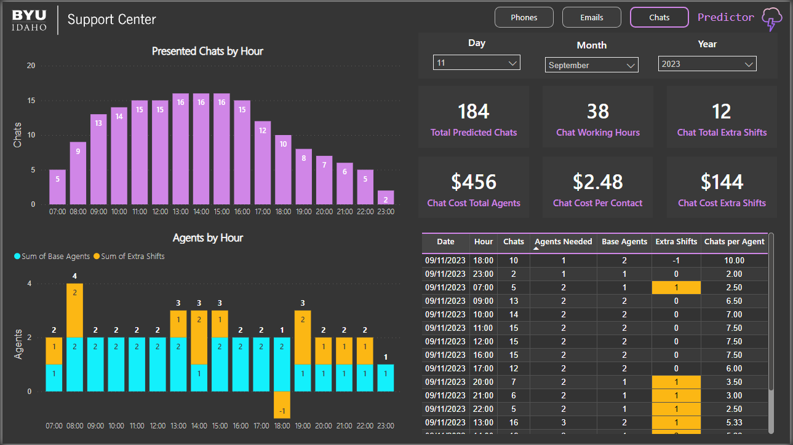
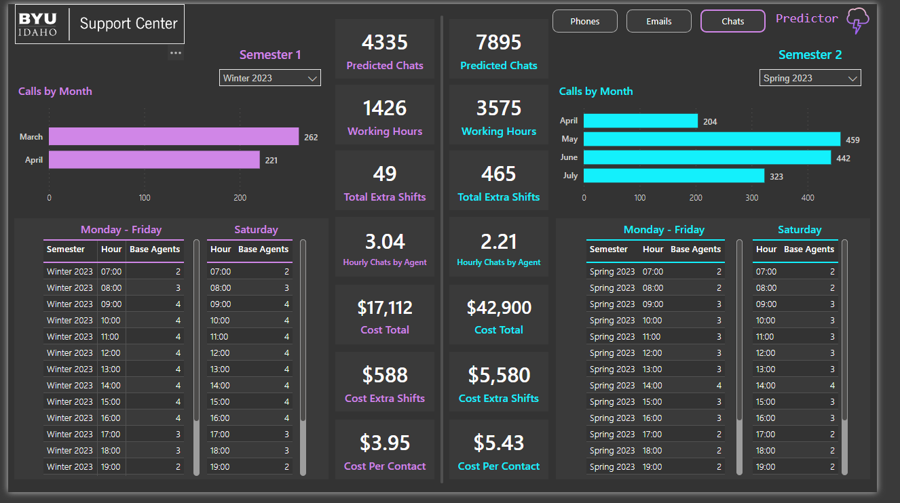
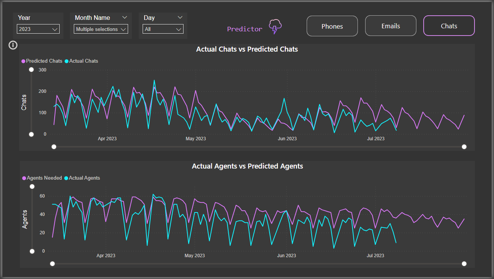
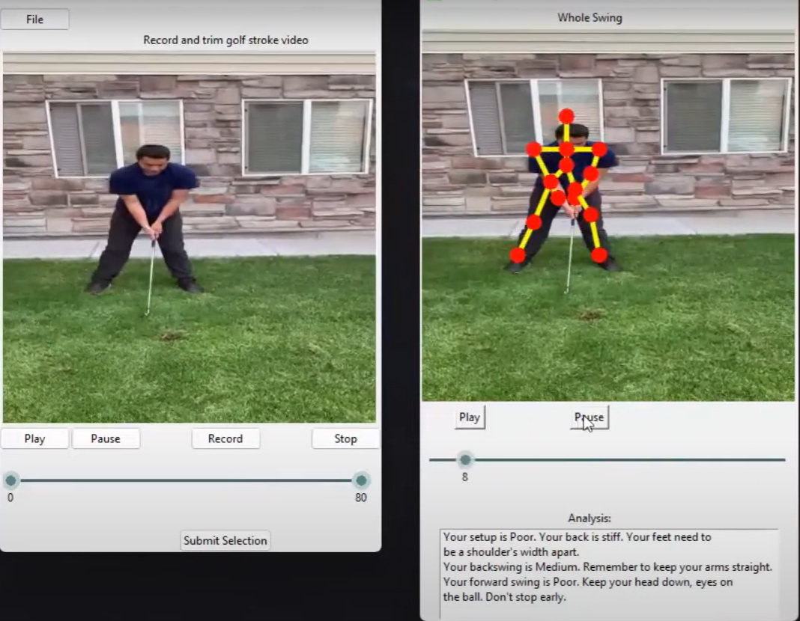
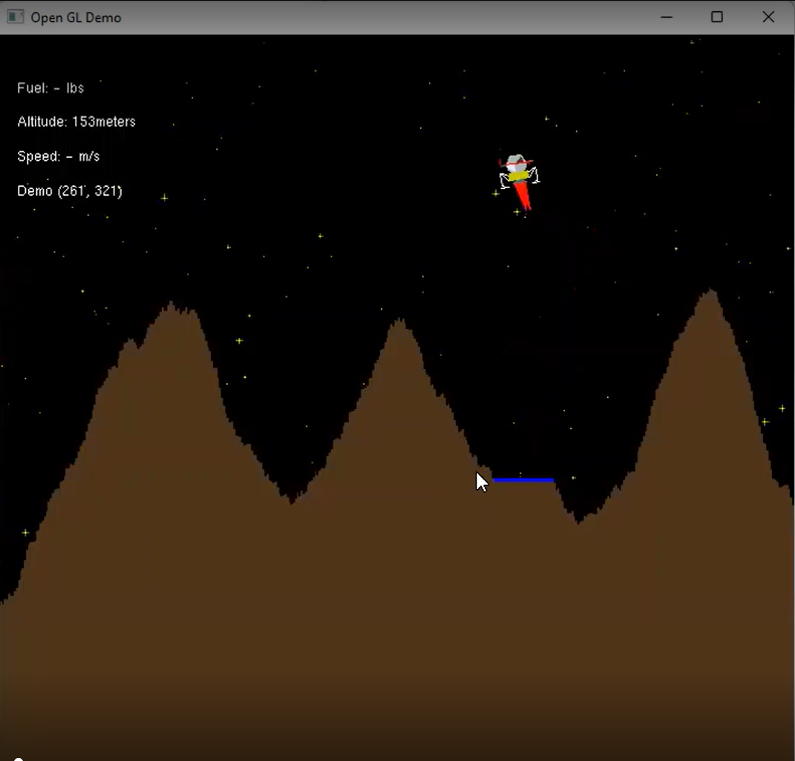
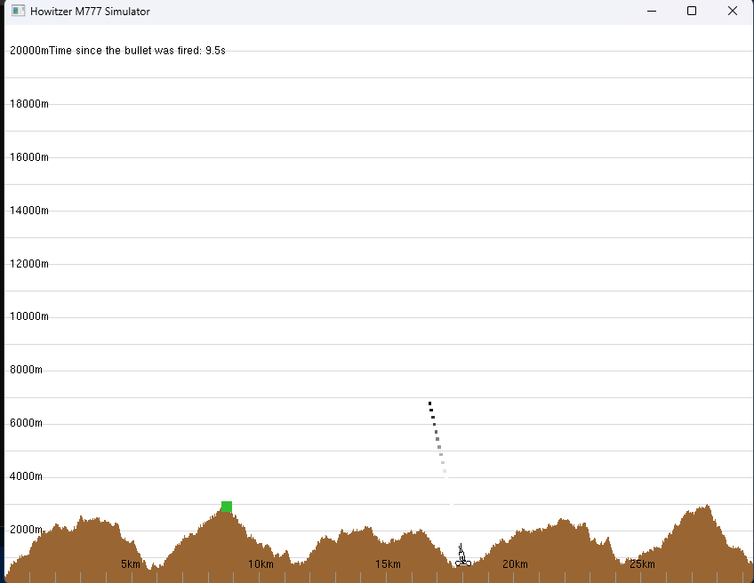

# Welcome to my Portfolio!

## About Me

3+ years of experience programming mainly in Python, Java, and C++

Passionate about technology! I believe that technology aids humans to develop their best attributes and have a healthier life, that's why I write code.                                                                            

Writing code is awesome, but the best part is when it actually runs!

### Internships:
- Software Engineer at Family Search
- Data Analys at BYU-I Support Center

### Education:
- __Computer Science__, __Machine Learning__ + __Software Design__ student at Brigham Young University Idaho

### Resume
 - [Download Here](ErickVega_2024.pdf)

## Projects on this repository

### [[Web App] EnrollEase (Smart Class Registration)](https://github.com/erickveg/EnrollEaseProject) 

This is an application that facilitates the creation of optimal class schedules for college students. It allows the students to choose the desired classes in a semester and creates a set of suggested schedules using optimization algorithms considering the location of a class, the time between classes, and the rate of the professors based on ratemyprofessor.com. This application currently doesn't support integrated authentication with a college institution, but it can web-scrape known interfaces where the student can log in.

See more details [here](https://github.com/erickveg/EnrollEaseProject/blob/main/EnrollEase%20Details.pdf).

This app is still under development.

### [App] Forecasting Tool (The Predictor)

This App was developed for the BYU-Idaho Support Center by Erick Vega. The main purpose of the app is to forecast the volume of contacts received in the next months and calculate the optimal number of agents needed to handle those contacts by semester and shifts. The Support Center found that some semesters there were too many agents or they were not distributed correctly, this was costing too much to the center. After 6 months of development, I am proud to present __The Predictor__, the first forecasting tool of the Support Center developed with Neural Networks. It can predict up to 2 years and it updates every week with new data. It has helped managers to distribute their workforce according to demand which in the best case can save up to $140K/year for the university.

The UI is simple, you select the day you want to forecast and that's it!

Manager can compare semesters, so they can organize shifts even before the next semester starts.

It's extremely accurate! This is a comparison of the predictions vs the actual values.

### [[App] Golf Swing Analyzer]([App]%20Golf%20Enhancer%20with%20CV%20and%20ML%20(Python))

This App was developed to make it easier for golfers to improve their skills without a human couch. OpenCV and other libraries were vital in analyzing several videos and training our ML model to evaluate the input video. This project can grow and even be marketable. A video demonstration is included.

__Gained Skills:__
- Implement strong Encapsulation practices
- Strong interaction with computer vision libraries (OpenCV, MediaPipe)
- Perform a full cycle of ML model training (Pandas, Scikit-learn)
- Ability to communicate, lead, and report on a development team

### [[Game] Apollo 11 Simulator]([Game]%20Apollo%2011%20Simulator%20(C++))

This Game/Simulator replicates some of the software and hardware functionalities of the original Lunar Module(LM) that was able to land in the moon on July 16, 1969. The user's objective is to land the LM on a landing area randomly generated on the surface of the ground. This exciting project required implementing Newton’s laws of motion, moon gravity, and the original features of the LM. 

__Gained Skills:__
- Design a program using flowcharts, pseudocode, Structure chats, data flow diagrams, and class relational diagrams
- Achieve high levels of software design principles like Fidelity and Robustness
- Learn to research a field out of my major scope (Physics)
- Perform black-box testing for every function and class
- High exposure to data structures, memory management, and class declarations in C++

### [[Game] Artillery M777 Simulator]([Game]%20Artillery%20M777%20Simulator%20(C++))

This Game/Simulator represents the basic functionalies of the M777 Howitzer which is a British artillery piece. The user's objective is to manipulate the direction of the howitzer so that when it fires the bullet can hit a target randomly generated on the ground. 

__Gained Skills:__
- Achieve high levels of software design principles like Convenience and Abstraction
- Determine when and why data protection principles are important
- Ability to do pair programming and manage projects within a team 
- Perform white-box testing for every function and class
- Automate the testing process within Visual Studio
- Convert client requirements into a technical plan

### [Data Science Projects](Data%20Science%20Projects)

This folder contains multiple projects related to data analysis and Machine Learning concepts. All the projects are documented and have graphs and charts designed by me for analysis. 

__Gained Skills:__
- Perform data engineering using Pandas
- Convert a word problem into requirements
- Clean and format large datasets
- Use SQL queries with Python through APIs
- Find hidden patterns and relate them to external variables
- Train Machine Learning models for predictive behaviors
- Design relevant data visuals using Altair

### [Data Structures Tutorial](Data%20Structures%20by%20Erick)

This is a detailed document I wrote about the most commonly used data structures in programming. I analyze their use cases supported by code examples, time efficiency analysis, and problems to solve for the reader.

__Gained Skills:__
- Ability to simplify complex concepts into simpler ideas
- Solid understanding of different data structures
- Optimize algorithms to achieve the best performance
- Write solid and clean documentation
